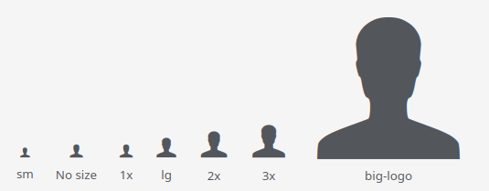

# Icons

### Service for adding, replacing and removing icons

```text
https://icomoon.io/app/
```

1. Upload an icon project file to the service - `Icons-project.json`


2. After change:
* Replace icon fonts in `dist/fonts`
* Update styles (do not replace) `dist/icons.css`
* Add new svg images to `svg` folder
* Save modified project `Icons-project.json`


### Icon options

* Resolution: 1024 x 1024 px
* Line thickness: 53px, 64px, 83px
* Medium icon size: 917.336px (inner icon - 64px = 789.336px)

### Installing

```shell
npm i @aleksi-magner/icons
```

or

```shell
yarn add @aleksi-magner/icons
```

### Usage

```html
<i class="vi vi-person"></i>
```

You can change the size of the icons using one of the following classes:

* icon-xs
* icon-sm
* icon-lg
* icon-1x
* icon-2x
* icon-3x
* icon-big-logo



## Good Boy License

We’ve released the icon pack either under MIT or the Good Boy License. We invented it. Please do _whatever your mom would approve of:_
* Download
* Change
* Fork
